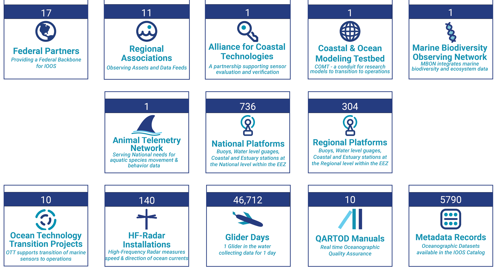
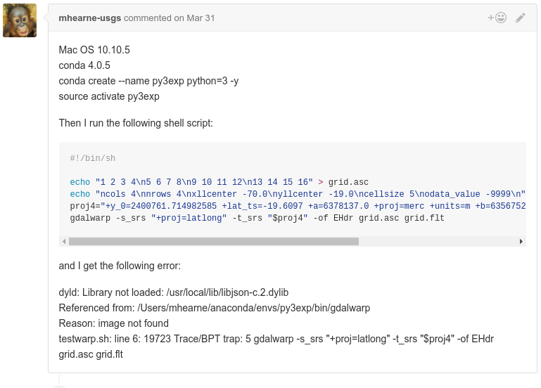
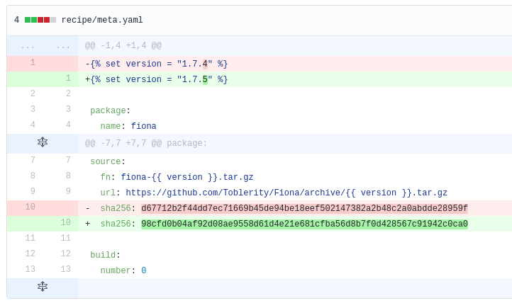
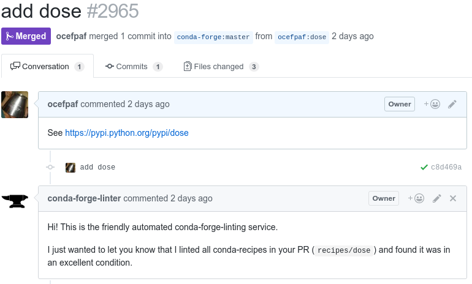
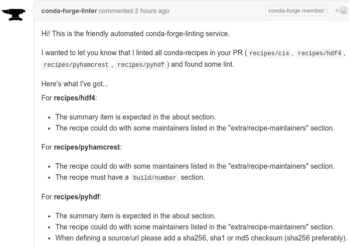
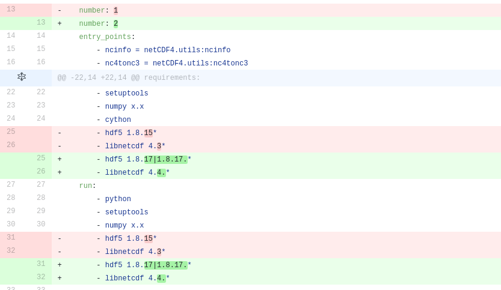

# Community powered packaging: **conda-forge**

<aside class="notes">
Show of hands

who uses conda?

knows about conda-forge?

contributed to conda-forge?
</aside>

# $ whoami?

- Filipe Fernandes
- twitter, GitHub, etc: [ocefpaf]((https://github.com/ocefpaf))

<aside class="notes">
Not a developer

I am a Physical Oceanographer

I am a scientist who code (not a data scientist!)
</aside>

# What I do?


<aside class="notes">
Physical Oceanographers like to throw electronic instruments into the salt water

We hope the instrument comes back with good data
</aside>

# IOOS


<aside class="notes">
Aside: a little about what I do

I work for the Integrated Ocean Observing System (IOOS for short)

IOOS splits the USA coastal areas into smaller regions
</aside>

# IOOS



<aside class="notes">
17 Federal partners and 11 regional associations

The partners are Universities, private companies, individuals

All collecting and sharing oceanographic data

netCDF files, HDF4/5, csv, and many other obscure data formats
Not to mention that data access protocols!

You all can imagine the kind problem we have here: Software deployment!
</aside>

# The Problem

The **scientific** Python community always wanted a

> - **cross-platform** package manager
> - that **does not** require elevated privileges
> - handles **all** types of packages
> - including compiled Python packages and **non-Python** packages
> - and generally lets Python be the awesome **scientific** toolbox of choice.

<aside class="notes">
The IOOS community problem

Other community also face similar issues
</aside>

# History
## pip before wheels


<aside class="notes">
Pretty much hell

Only pure python packages were easy to install

Fortran, C/C++, Cython extensions were always challenging

We had to apt-get/brew install before pip installing anything

Windows users suffered the most
</aside>

# History
## distributions


<aside class="notes">
Slightly better, but anything that was not pre-packaged was still hard

In some cases even harder than with pip+system Python alone
</aside>

# History
## conda and the various 3rd party channels


<aside class="notes">
Experts could create their own distribution and share in a channel

Novice and intermediate users were often confused with the high number of channels

Wrong metadata permeated some channels: wrong version

At this stage some communities started to form: scitools (UK MetOffice), IOOS, bioconda, omnia, etc.
</aside>

# History
## pip after wheels


<aside class="notes">
The situation is much better now with pip

Developers can upload binaries to PyPI

Users can just pip install <package>

And everything works!
</aside>

# We are happy, right!?

. . .


<aside class="notes">
Not so much :-(

PyPI is a place were the packages are uploaded, but it is very hard to find information on how they where built

Many packages have flags and switches

Some developers don't want to maintain the binaries
</aside>

# Packaging is not easy

> - We still have trouble installing packages in our machines
> - Worse when the packages use `ctypes` to access an odd dependencies,
> - or has a compilation step: `cython`, `C`/`C++`, or `Fortran` extension
> - Windows!? `vcvarsall.bat`!!!

. . .

 (╯°□°）╯︵ ┻━┻

# What is a conda?

> - An open-source packaging system developed for, and used by, the scientific software community.
> - From their own docs:
> - "Package Everything!"
> - "And share your repositories with clients or colleagues."

<aside class="notes">
We made a choice to use conda
</aside>

# Why conda?

> - Why not `apt-get`, `yum`, `chocolatey`, or `brew`?
> - Why not pip and wheels?

<aside class="notes">
It would be virtually impossible to do the with native package managers on all systems

pip relies on PyPI as a platform to publish the packages

We need a platform to manage (GitHub), Build, (CIs), and publish (anaconda.org)
</aside>

# What is a conda channel?

> - Is similar to a Linux repository (or app store)
> - The service is hosted for free at Continuum's Anaconda Cloud
> - We can upload pre-compiled binaries using the `conda` package manager

# Packaging is hard and you should not do it alone!


<aside class="notes">
conda-forge solution is to aggregate as many as we can find

and use the power of the community

that is the only solution that scales
</aside>

# How is conda-forge different from any other 3rd party channel?

> - It is a community led collection of **recipes**,
> - build **infrastructure**,
> - and packages for the **conda** package manager.

<aside class="notes">
defaults does not scale to the community demands

cloud infrastructure

not a distribution

continuum had a single community repository

no builds and did not scales
</aside>

# conda-forge


<aside class="notes">
recipe fragmentation
</aside>

# Recipes 0

```yaml
package:
  name: pandas
  version: {{ version }}
source:
  url: https://github.com/pydata/pandas/archive/v{{ version }}.tar.gz
  sha256: d9f67bb17f334ad395e01b2339c3756f3e0d0240cb94c094ef711bbfc5c56c80
build:
  number: 0
  script: python setup.py install --single-version-externally-managed --record=record.txt
```

<aside class="notes">
RPM specfile
</aside>

# Recipes 1

```yaml
about:
  home: http://pandas.pydata.org
  license: BSD 3-clause
  summary: 'High-performance, easy-to-use data structures and data analysis tools.'
extra:
  recipe-maintainers:
    - jreback
    - jorisvandenbossche
    - TomAugspurger
```


# Infrastructure

> - The recipes are hosted on [GitHub](https://github.com/conda-forge)
> - [AppVeyor](http://www.appveyor.com/) &#10139; Windows
> - [Travis-CI](https://travis-ci.org/) &#10139; OSX
> - [CircleCI+Docker](https://github.com/conda-forge/docker-images) &#10139; Linux

<aside class="notes">
The choice was straight forward

AppVeyor provides Win32/64 and all MSVCs (Python 2.7, 3.4, 3.5/3.6 vc9, vc10, vc14)

With Travis-CI we are stuck with the X-code image they provide

On Linux we have 100% of freedom via a docker image
</aside>

# The community by numbers
## outdate daily

> - 458 people
> - 2,456 teams
> - 2,461 repositories

# How to use the channel?

```bash
conda config --add channels conda-forge

conda install gdal -c conda-forge
```

# How to help the community?

> - reporting issues
> - updating existing packages
> - adding new packages
> - reviewing new recipes

# Reporting Issues



# Updating a recipe



# Adding new packages
## everything starts with a PR

> - The point of entry is [staged-recipes](https://github.com/conda-forge/staged-recipes)
> - Once the PR is accepted a GitHub team is created based on the maintainers list
> - The maintainers have commit rights only to their own recipes


# staged-recipes PR



# What is a feedstock?

> - The new package lives in the [feedstock](https://github.com/conda-forge/dose-feedstock)
> - This Repository, CI configuration, team permissions are automatically created
> - The tooling lives in [conda-smithy](https://github.com/conda-forge/conda-smithy)

# Reviewing recipes

> - not everything can be automated
> - it is one of the most human-time demanding activity in `conda-forge`
> - consists on catching errors and suggesting "best practices"

# Looking under the hood

> - `conda-smithy` tool to lint, re-render, and create the feedstocks
> - heroku services to update the feedstocks (auto re-render)
> -  and to pin the dependencies to a 'known' set versions

<aside class="notes">
There is a fair bit of automation in conda-forge

But we need more: improve the linter, recipe cleaner, auto updates
</aside>

# linter



```shell
conda smithy recipe-lint
```

# conda-smihty templates

```jinja
osx_image: xcode6.4


env:
  
  matrix:
    
    - {{ matrix_env(case) }}
    
  
```

# MNT updating a feedstock


<aside class="notes">
bot runs periodically and send a PR whenever there is a fundamental change in the template
</aside>


```shell
conda smithy rerender
```

# MNT pinning the dependencies



# Pinning bot

```python
pinned = {
          'boost': 'boost 1.64.*',
          'bzip2': 'bzip2 1.0.*',
          'cairo': 'cairo 1.14.*',
          'ffmpeg': 'ffmpeg 2.8.*',
          'freetype': 'freetype 2.7|2.7.*',
          'geos': 'geos 3.5.1',
          'giflib': 'giflib 5.1.*',
          ...
        }
```

<aside class="notes">
pinning, compilers, and other infrastructure details are decided by the core members
</aside>

# Who are the core members?


<aside class="notes">
the core meets hold by-weekly (open) meetings

anyone can participate

the details are hosted on `hackpad` (moving to dropbox paper)
</aside>

# But why not just upload wheels for dose to PyPI?

> - PyPI is a first come first served publishing platform
> - One will need the authors permission to do that
> - Wheels can be built on GitHub using CIs but in a de-centralized way
> - Hard to share experience and take advantage of the community
> - The dream? Use conda-forge workflow to publish wheels on PyPI too

# Want to know more?

- [http://wesmckinney.com/blog/conda-forge-centos-moment/](http://wesmckinney.com/blog/conda-forge-centos-moment/)
- [https://www.continuum.io/blog/developer-blog/community-conda-forge](https://www.continuum.io/blog/developer-blog/community-conda-forge)
- [http://jakevdp.github.io/blog/2016/08/25/conda-myths-and-misconceptions/](http://jakevdp.github.io/blog/2016/08/25/conda-myths-and-misconceptions/)
- [https://talkpython.fm/episodes/show/94/guarenteed-packages-via-conda-and-conda-forge](https://talkpython.fm/episodes/show/94/guarenteed-packages-via-conda-and-conda-forge)


# Aside: conda

- `conda` is a cross platform package manager (compare `conda` to `apt-get`/`yum`/`zypper` not `pip`)
- manage multiple sources of binaries: `numpy`+`atlas`, `numpy`+`openblas`, `numpy`+`mkl`
- cannot install directly from source (can install Python)
- should not be used as a canonical source for Python packages

# Aside: pip

- will install into your system Python easily (but cannot install Python)
- can install packages directly from the source distribution
- cannot manage multiple sources of binaries: `numpy`+`openblas` built with `manylinux1`
- `pip` (and PyPI) **is** the canonical source for Python packages


# conda+pip

```yaml
name: IOOS
channels: conda-forge
dependencies:
  - jsanimation
  - pynco
  - emacs
  - r-oce
  - pip: dolfyn
```
. . .

```shell
conda env create environment.yml
```

# A tale of ~~two~~ packages
### (actually only one with two hard to install dependencies)

`dose` install instructions:

> - Install `gtk` library and headers  (dev/devel/etc)
> - Install `wxpython`
> - `pip install dose`

. . .

Not easy for most users!

# conda-forge solution for dose?

> - Same steps! But we need to do it only once.
> - The build steps (recipe) and the binary are shared on the cloud
> - Then anyone can just `conda install dose --channel conda-forge`

# Questions ?

<aside class="notes">
what if I cannot install binaries due to security reasons? Can I still use conda-forge somehow?

trusting the binaries, is it any different then a source package on PyPI?

conda-forge packages may contain patches

no sign packages

how hard is to build on all platforms? Depends on the package (cmake is always easier)

take advantage of the community. There is a lot of expertise on packaging there
</aside>
